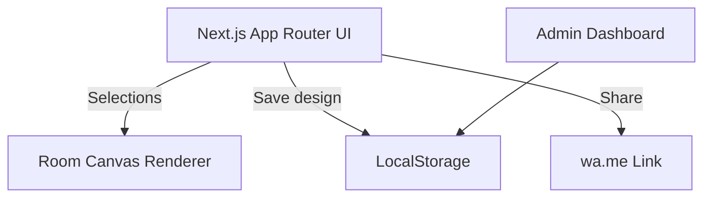

# Sri Majisa Plywood & Interior Hardware — Interior Customizer

A production-ready Next.js 14 web app that lets showroom visitors visualize laminates and hardware options for bedrooms, kitchens, and main doors. Designed for in-store tablets and mobile devices with offline-ready LocalStorage persistence and quick WhatsApp sharing.

## Quickstart

```bash
npm install
npm run dev
```

Open [http://localhost:3000](http://localhost:3000) on mobile or a tablet browser.

## Local Setup (Windows)

1. Install **Node.js 20 LTS** from <https://nodejs.org/> and confirm it is available:

```powershell
node --version
npm --version
```

2. Clone this repo and install dependencies:

```powershell
git clone <your-repo-url>
cd interior-customizer-app
npm install
```

3. Start the development server:

```powershell
npm run dev
```

4. Visit [http://localhost:3000](http://localhost:3000) in Edge/Chrome. For tablet testing, open the same URL on the device (ensure both are on the same network).

### Windows Notes

- If `npm` uses a proxy or restricted registry, configure `.npmrc` accordingly.
- For offline demo usage, run the dev server once to cache dependencies, then the app can run without external services.

## Features

- **Mobile-first, touch-optimized UI** for showroom tablets and phones.
- **Real-time canvas visualization** for Bedroom, Kitchen, and Main Door.
- **Laminates + hardware selection** with instant preview updates.
- **Save design with unique code** stored offline in LocalStorage.
- **WhatsApp sharing** with prefilled summary.
- **Hindi + English bilingual** toggle.
- **Admin dashboard** for customer leads saved on device.
- **Vercel-friendly** Next.js 14 + TypeScript stack.

## Architecture Diagram



## Project Structure

```
app/
  admin/
    page.tsx          # Admin dashboard (local leads)
  components/
    Header.tsx        # Branding + language toggle
    RoomCanvas.tsx    # Canvas-based visualization
    SelectionPanel.tsx# Laminate + hardware selectors
  globals.css         # Mobile-first styling
  layout.tsx          # Root layout
  page.tsx            # Main visualizer
```

## Customization Points

- **Branding**: Update store name, tagline, and hero text in `app/components/Header.tsx`.
- **Products**: Update `rooms`, `laminates`, and `hardwareOptions` in `app/page.tsx`.
- **Contact info**: Update WhatsApp formatting or default phone handling in `app/page.tsx`.
- **Admin lead fields**: Extend the `SavedDesign` type in `app/page.tsx` and `app/admin/page.tsx`.
- **Colors/typography**: Adjust CSS variables in `app/globals.css`.

## Deployment (Vercel)

1. Push this repository to GitHub.
2. Create a new Vercel project and import the repo.
3. Set **Framework Preset** to **Next.js**.
4. Deploy. No additional environment variables required.

## Offline Use

The app stores all designs in the device's LocalStorage. Leads remain available on the same device even without internet access. Use the **Admin Dashboard** to review saved leads.

## Notes

- For best results, run on modern tablet browsers (Chrome/Edge).
- WhatsApp sharing opens a new tab with a prefilled message.
